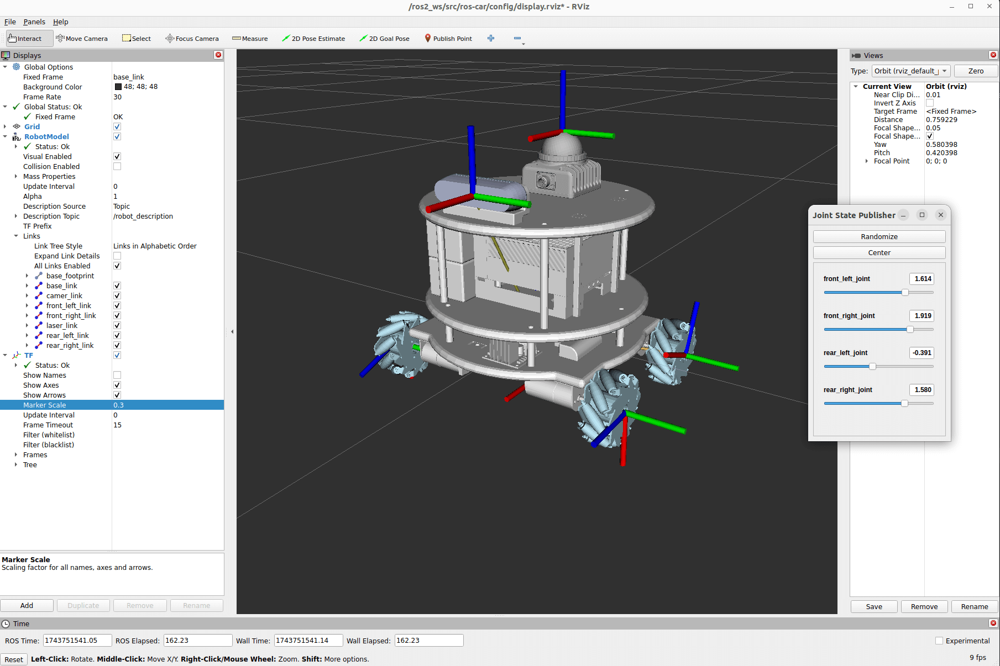

# ROS Car

This is a ROS2 control car, designed by wty-yy.

> Create template from [joshnewans/my_bot](https://github.com/joshnewans/my_bot).

## Install
Download relate packages: `colcon, gazebo, xacro, joint_state_publisher_gui, ros_controllers`, or pull from my docker image [wtyyy/ros:ros2-jazzy-ubuntu24.04](https://hub.docker.com/repository/docker/wtyyy/ros/general), **we need use latest ros2 distribution JAZZY, because mecanum_drive_controller only supports Rolling and Jazzy from [ros2_controllers:4.17.0](https://github.com/ros-controls/ros2_controllers/tree/4.17.0)**
```bash
docker pull wtyyy/ros:ros2-humble-cuda11.8.0-ubuntu22.04
```

Clone repository in `/your_ws/src/`
```bash
cd /your_ws/src
git clone https://github.com/wty-yy/arduino_wheel_drive.git
cd arduino_wheel_drive
git checkout 4_wheel_drive

cd ..
git clone https://github.com/wty-yy/ros-car.git
cd ros-car
colcon build --symlink-install
source ./install/setup.sh
```

Motor DEBUG Tool: [wty-yy/serial_motor_demo:4_wheel_drive](https://github.com/wty-yy/serial_motor_demo/tree/4_wheel_drive)

## Launch
### Display
```bash
ros2 launch ros_car display.launch.py
```


### Gazebo simulator
1. RSP(robot state publisher) + Gazebo simulator + Joystick control
    ```bash
    ros2 launch ros_car launch_all_sim_rsp_joy.launch.py
    ```

2. Real humburobot + Joystick control
    ```bash
    ros2 launch ros_car launch_real_robot_joy.launch.py
    ```

### Debug Joystick
Support xbox series, xbox 360
```bash
ros2 launch ros_car joy.launch.py joystick:=xbox360
ros2 launch ros_car joy.launch.py joystick:=xbox_series
```

### Run real robot
Support xbox series, xbox 360
```bash
ros2 launch ros_car launch_real_robot_joy.launch.py joystick:=xbox360
ros2 launch ros_car launch_real_robot_joy.launch.py joystick:=xbox_series
```

## Robot model file
1. URDF: [description/hamburobot_mecanum_sw2urdf/urdf/hamburobot_mecanum_sw2urdf.urdf](./description/hamburobot_mecanum_sw2urdf/urdf/hamburobot_mecanum_sw2urdf.urdf)
2. SolidWorks: Waiting...

## Result

https://github.com/user-attachments/assets/d94e3b33-25b1-4a39-bafd-ced19d181e7f

